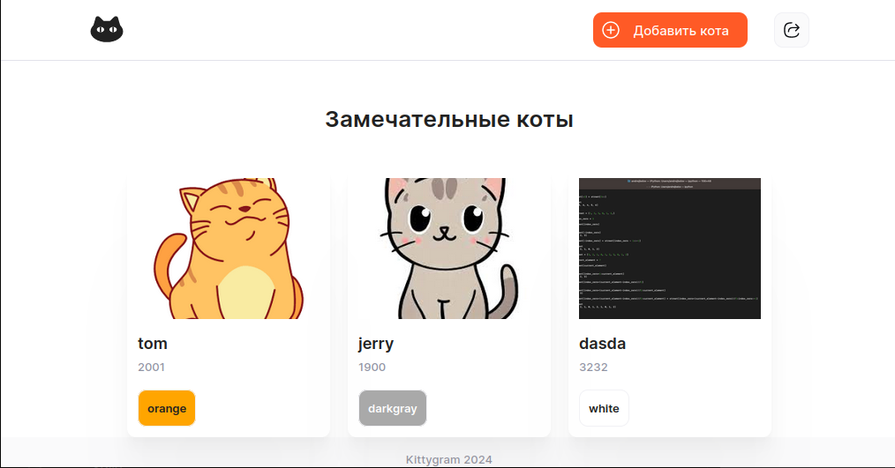

#  Проэкт лучшего сайта в Рунете для котов и тех, кто их любит! :smiley_cat:


## Создан для максимально быстрого и простого развертывания на сервере, с использование технологии контейнеризации.

---

### Как запустить проэкт.
> Файл `docker-compose.yml`в корне проэкта предназначен для локального запуска и тестирования возможностей.
```
docker compose up 
```
***
> Файл  `docker-copose.production.yml` для запуска на сервере.
```
docker compose -f docker-compose.production.yml up
```

---
### Используемые образы в основе.
> * `postgres 13`
> * `nginx 1.21.1`
> * `node 18`
> * `python:3.9.6-slim-buster`

### Готовые образы на DockerHub.
> * `sergeyku87/kittygram_backend`
> * `sergeyku87/kittygram_gateway`
> * `sergeyku87/kittygram_frontend`

### Визуальный пример Вашего будущего сайта.[^1]

---
[^1]: Наши модераторы следят за тем, что бы кроме котов, ничего на сайте не было, но сейчас они в отпуске.

